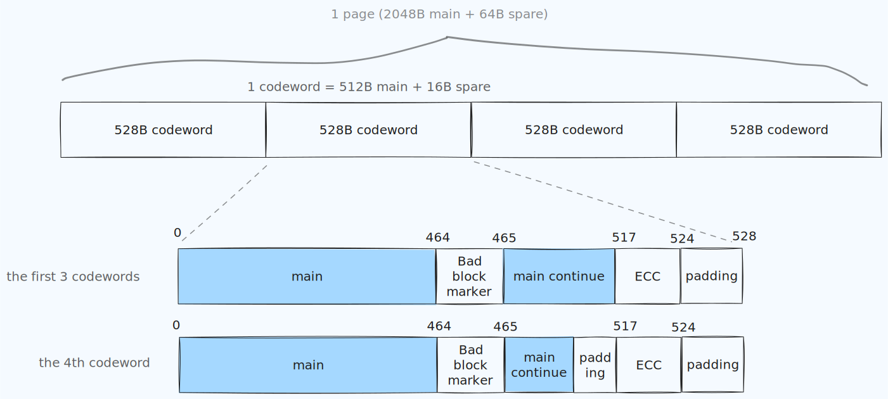

# Deco X50 Firmware Unpack
## About
TODO
## Hardware Specifications
TODO
### NAND Layout and ECC

Qualcomm SoC has their own layout for flash memory which is different from the standard 512 bytes of main data followed by 16 bytes of spare as suggested by flash vendors. 



The flash chip we are working with here has the model number of F50D1G41LB with 128MB storage. The device boot log indicated that it uses 4-bit ECC under QPIC NAND controller. The details have already been documented in the [Linux kernel](https://git.kernel.org/pub/scm/linux/kernel/git/torvalds/linux.git/tree/drivers/mtd/nand/raw/qcom_nandc.c?id=197b88fecc50ee3c7a22415db81eae0b9126f20e#n2326), but one could still recognize the boundaries from looking at the flash dump in a hex editor.

## Useful Commands

The project uses `bchlib` to calculate and correct ECC errors. PyPoetry is required. The parameters for this particular chip could be found in `config.py` file.

Install dependencies

```
poetry install
```

### Correct ECC errors

This chip uses the popular BCH algorithm with the ability to correct up to 4 bit flips and uses 7 bytes for ECC data.

```
poetry run python correct-errors.py flashdump.bin
```

### Strip out non-data (Out-of-Band) parts

In order for type of each binary files that will be generated later on to be detectly and unpacked properly, the extra data used for error correcting has to be stripped out to make all embedded file headers align with the start of a block.

```
poetry run python remove-oob.py flashdump.bin.corrected
```

### Split the binary file

At this stage, binwalk could be used, but since address mapping is available, splitting the file according to that would be better.

```
poetry run python carve-mtds.py flashdump.bin.corrected.main map.txt
```

Example for `map.txt` (obtained from boot log via UART)

```
[    1.024163] Creating 16 MTD partitions on "qcom_nand.0":
[    1.030366] 0x000000000000-0x000000080000 : "SBL1"
[    1.037188] 0x000000080000-0x000000100000 : "MIBIB"
[    1.042117] 0x000000100000-0x000000140000 : "BOOTCONFIG"
[    1.056959] 0x000000140000-0x000000180000 : "BOOTCONFIG1"
[    1.068291] 0x000000180000-0x000000280000 : "QSEE"
[    1.080176] 0x000000280000-0x0000002c0000 : "DEVCFG"
[    1.091481] 0x0000002c0000-0x000000300000 : "CDT"
[    1.102745] 0x000000300000-0x000000380000 : "APPSBLENV"
[    1.114267] 0x000000380000-0x0000004c0000 : "APPSBL"
[    1.126468] 0x0000004c0000-0x0000005c0000 : "ART"
[    1.138435] 0x0000005c0000-0x000000640000 : "TRAINING"
[    1.149965] 0x000000640000-0x000003040000 : "rootfs"
[    1.199413] 0x000003040000-0x000005a40000 : "rootfs_1"
[    1.249128] 0x000005a40000-0x000005ac0000 : "ETHPHYFW"
[    1.260655] 0x000005ac0000-0x0000063c0000 : "factory_data"
[    1.279123] 0x0000063c0000-0x0000074c0000 : "runtime_data"
```

Each mtd partition is stored under `parts/mtd<number>.<name>.bin`

### Unpack UBI partitions